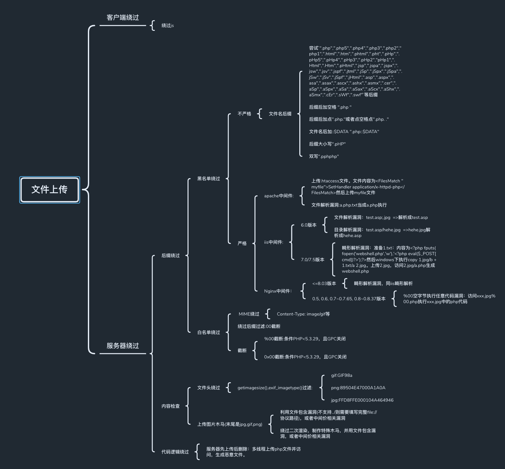
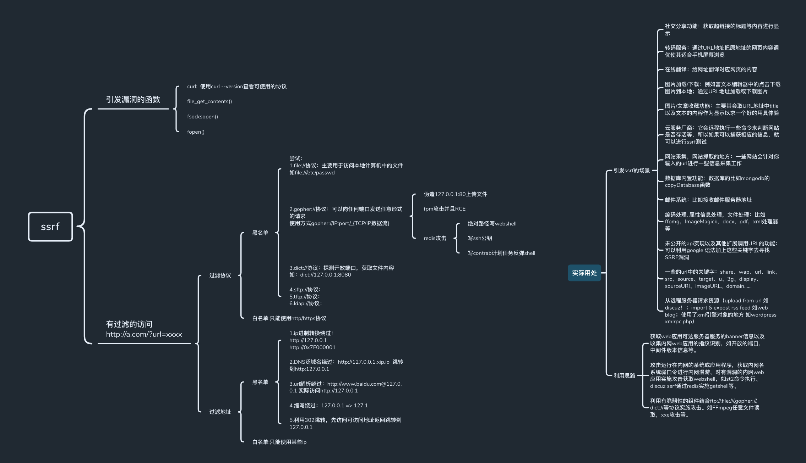

# network-security
appactivate

学习网络安全练习过的靶场，笔记，还有一些好文章
之后会有一些实战案例

## 靶场：

**SSRF:**
1.ssrf-lab:https://github.com/m6a-UdS/ssrf-lab.  
ssrf-lab靶场教程：https://www.codenong.com/cs105709428/.  
2.ctfhub.com中ssrf模块.  
**XSS:**
1.xss学习，以及利用平台：https://xssaq.com/xss.php    
2.xss-lab:https://github.com/paralax/xss-labs.   
**UPload:**
1.upload-labs:  https://github.com/c0ny1/upload-labs.  
**Sqli:**
1.sqli-lab:https://github.com/Audi-1/sqli-labs.  

### 综合靶场：
1.www.ctfhub.com.  
2.dvwa.  
3.pikachu.  
4.bwapp.  

## 渗透实战文章
[前端JavaScript渗透测试步步为营](https://www.freebuf.com/vuls/255640.html)  
[挖到这个高危SSRF漏洞，小伙伴们都惊呆了！](https://www.freebuf.com/vuls/265163.html)  
[一次文件读取漏洞的“危害升级”历程](https://www.freebuf.com/vuls/257629.html)  
[记一次微信小程序渗透测试](https://www.secpulse.com/archives/144738.html?hmsr=toutiao.io&u=&utm_medium=toutiao.io&utm_source=toutiao.io)
[SRC逻辑漏洞挖掘详解以及思路和技巧](https://mp.weixin.qq.com/s/pextke3A1SVhLx2O0TKfzw)
[xss的一些资源和问题](https://blog.csdn.net/superprintf/article/details/113058825)

## 安全大佬的个人网站
Poc Sir : https://www.hackinn.com/
Ascotbe：https://www.ascotbe.com/
zgao：https://zgao.top/
神风：https://www.cnblogs.com/wh4am1/
奶思：https://www.cnblogs.com/nice0e3/
橙子：https://0range-x.github.io/
尖尖：http://www.whiskeyjj.com/
Mrkaixin: https://www.mrkaixin.top/
L1near: https://l1near.top/
Depy: https://blog.happysec.cn/
p3rh4ps: https://p3rh4ps.top/
glotzz: https://niudaii.github.io/
国光：https://www.sqlsec.com/
4ra1n：https://4ra1n.love
novy: https://novysodope.github.io/
金强银矛小霸王：https://www.ch1ng.com
九八二十一：https://jiubaeryi9821.github.io/
Nolan: https://www.cnblogs.com/-zhong/
leihehe：https://leihehehe.github.io
h11ba1：http://h11ba1.com/
1ndex：https://www.cnblogs.com/wjrblogs/
peri0d： https://www.cnblogs.com/peri0d/
reader-l：https://reader-l.github.io/
L1ngFeng：https://0vv0.in/
JunMo: http://blog.mo60.cn/
XINGEZ：https://blog.xingez.me/

## 其他
### git命令简易教程网站
https://www.bootcss.com/p/git-guide/.  
### 谈谈渗透测试和红队的区别
https://www.secrss.com/articles/12168

## 总结且完善中的图片(文件夹下有xmind思维导图文件)

